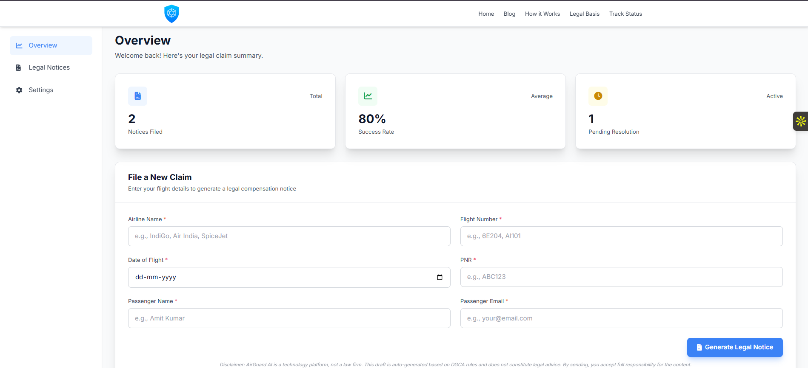
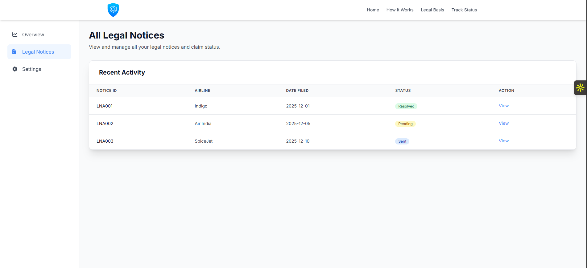

Status: Production Prototype

# AirGuardLegal ✈️⚖️
**AI-Powered Aviation Crisis Management & Legal Compliance Platform**

## Tech Stack

FastAPI | Next.js | Python | Supabase | Aviationstack API | WhatsApp API


🌐 Live Demo: https://www.airguardlegal.com/  
💻 GitHub Repository: https://github.com/amitmurmu12360/AirGuardLegal  
👤 Author: Amit Murmu    

---

## Overview

AirGuardLegal is an AI-powered aviation crisis management and legal compliance platform designed to automatically detect flight disruptions, determine passenger compensation eligibility, and generate structured legal and operational reports in real time.

The platform transforms aviation disruption data into actionable intelligence, enabling automated compliance with passenger rights regulations such as DGCA and EC261.

It was developed as an operational prototype to demonstrate how AI-driven automation can improve crisis response, regulatory compliance, and passenger compensation workflows.

---
## Key Engineering Highlights

• Built full-stack production-grade platform handling real-time flight telemetry  
• Designed automated regulatory decision engine using DGCA & EC261 logic  
• Implemented async backend architecture for scalable event processing  
• Integrated real-time notification system using WhatsApp API and webhooks  
• Deployed live SaaS prototype with frontend, backend, and database integration

## Problem Statement

Flight delays, cancellations, and operational disruptions create complex legal and operational challenges for airlines and passengers.

Key issues include:

- Manual and slow compensation eligibility determination  
- Lack of real-time disruption monitoring  
- Delayed communication with affected passengers  
- Poor auditability and compliance tracking  
- Fragmented operational visibility during crises  

These limitations increase operational risk and reduce passenger trust.

---

## Solution

AirGuardLegal provides an automated crisis response and legal compliance system that:

- Detects flight disruption events using real-time flight telemetry  
- Determines passenger compensation eligibility automatically  
- Generates structured legal and operational reports  
- Sends automated alerts to passengers and stakeholders  
- Provides a centralized dashboard for disruption monitoring  

This significantly reduces manual workload and improves crisis response efficiency.

---

## Core Features

### Real-Time Flight Disruption Detection

Integrates with aviation telemetry APIs to monitor live flight status and detect disruptions.

---

### Automated Compensation Eligibility Engine

Implements regulatory decision logic based on:

- DGCA Passenger Charter  
- EC261 European Air Passenger Rights  

Automatically determines passenger compensation eligibility.

---

### Event-Driven Passenger Notification System

Automatically sends:

- WhatsApp alerts  
- Email notifications  

to inform passengers and stakeholders about disruption events.

---

### Crisis Monitoring Dashboard

Provides operational visibility through:

- Real-time disruption tracking  
- Compensation status reporting  
- Compliance monitoring  

---

### Legal Audit and Compliance Logging

Maintains structured audit records to support:

- Regulatory compliance  
- Operational reporting  
- Compensation documentation  

---

## System Architecture Diagram


High-Level Flow:

```
Flight Telemetry API
        ↓
Backend Processing Engine (FastAPI)
        ↓
Compensation Decision Logic
        ↓
Dashboard & Legal Report Generation
        ↓
Passenger Notification System
```

---

## Tech Stack

### Frontend

- Next.js  
- React  

### Backend

- FastAPI  
- Python  

### APIs & Integrations

- Aviationstack API  
- WhatsApp API  
- REST APIs  

### Infrastructure

- Supabase  
- Webhooks  

---

## Screenshots

### Crisis Monitoring Dashboard



---

### Compensation Report Output



---

## Live Demo

Access the live platform:

https://www.airguardlegal.com/

---

## Technical Highlights

- Real-time telemetry ingestion and processing  
- Automated regulatory decision engine  
- Event-driven system architecture  
- AI-assisted disruption classification  
- Automated communication workflows  

---

## Use Case Example

Example workflow:

1. Flight disruption detected via telemetry API  
2. System analyzes disruption conditions  
3. Compensation eligibility automatically calculated  
4. Legal compliance report generated  
5. Passenger notified automatically  

---

## Future Enhancements

Planned improvements include:

- Multi-airline support  
- Predictive disruption forecasting  
- Advanced AI-based risk analysis  
- Enterprise-scale deployment  

---

## Repository Structure

```
AirGuardLegal/
│
├── README.md
│
├── architecture/
│   └── architecture.png
│
├── screenshots/
│   ├── dashboard.png
│   └── report.png
│
├── frontend/
│
└── backend/
```


---

## Author

**Amit Murmu**

Data Analyst | AI Systems Builder

LinkedIn: https://www.linkedin.com/in/insightsbyamit07/  
GitHub: https://github.com/amitmurmu12360  

---

## License

This project is for demonstration and educational purposes.


